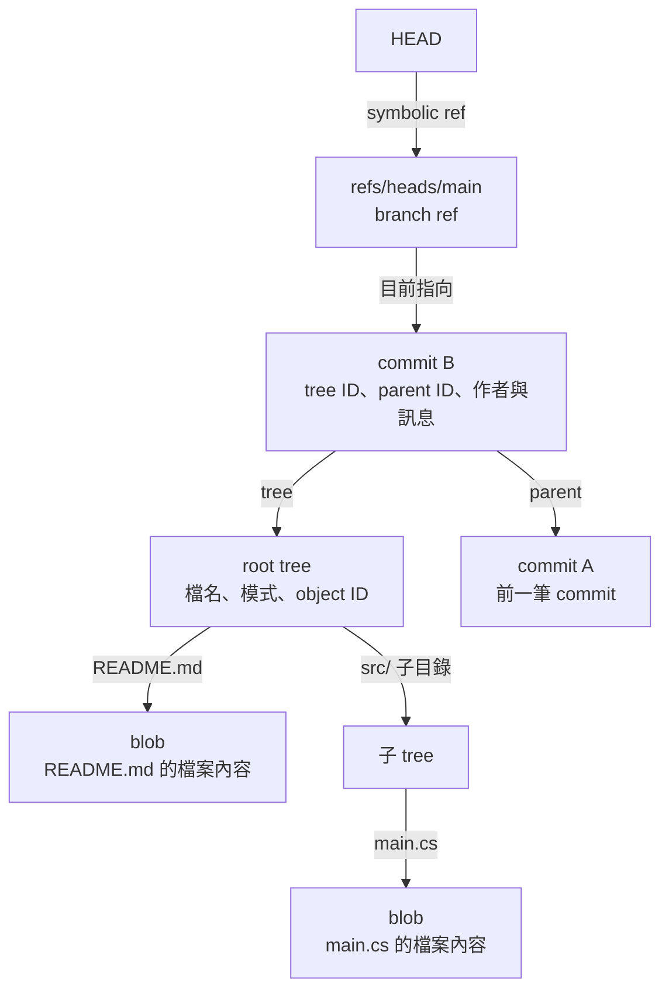
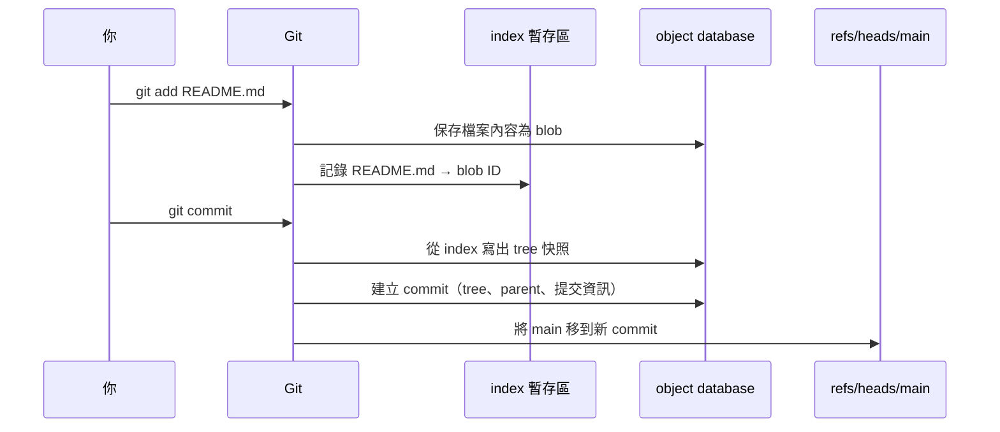

# Git 物件模型：commit、tree、blob、ref

## 先建立的心智模型

- **blob** 保存檔案內容，不保存檔名。
- **tree** 保存目錄項目，包括名稱、檔案模式，以及指向 blob 或子 tree 的 object ID。
- **commit** 指向一個 tree，並記錄 parent commit、作者、提交者與訊息。合併 commit 可以有多個 parent。
- **ref** 是方便閱讀的名稱，保存某個 object ID。branch ref 通常指向 commit，例如 **refs/heads/main**。
- commit、tree、blob 是以內容定址的物件。建立 branch 主要是建立一個 ref；建立 commit 時 Git 產生新物件，再移動 branch ref。
- **HEAD** 通常是 symbolic ref，指向目前 branch。Annotated tag ref 可以指向 tag object，所以不是所有 ref 都直接指向 commit。

可以把提交歷史想成一張圖：commit 透過 parent 形成歷史；commit 指向 tree；tree 再往下指向 blob 和子 tree。branch 名稱只標示圖上的某個 commit。

## 先看圖：檔案、快照和分支怎麼連起來

先記住四樣東西：**blob 是檔案內容、tree 是目錄清單、commit 是一次快照、branch 是指向某個 commit 的名稱**。圖中的箭頭表示左邊保存右邊的 ID；`HEAD` 則通常保存目前 branch ref 的名稱。

所以 blob 本身不知道檔名；tree 才把檔名和 blob 接起來。commit 記住 tree 和前一筆 commit；`main` 這個 branch ref 只要改指向新的 commit，就代表分支前進了。

### `git add` 和 `git commit` 各做什麼

這張圖把命令流程拆開。index（暫存區）不是 commit，也不是一般 Git object；它記錄這次準備提交的路徑和物件 ID。

最短記法：**add 把檔案內容和路徑放進 Git 的準備區；commit 把準備好的目錄狀態封成快照，接到歷史上，再移動目前分支。**

## Pro Git 第 10 章原文整理

以下依 Pro Git 第二版英文第 10.1–10.3 節整理並翻譯成繁體中文，按本系列的自架平台主題重新編排；這是摘要式筆記，不是逐段直譯。Pro Git 由 Scott Chacon 與 Ben Straub 撰寫，採 CC BY-NC-SA 3.0 授權。

### 10.1 Plumbing 與 Porcelain：介面和底層工具

Git 可以看成一個以內容計算名稱的檔案資料庫，上面再提供版本控制操作介面。日常使用的 `git add`、`git commit`、`git branch` 等命令是較好操作的 **porcelain**；負責讀寫底層資料的命令則稱為 **plumbing**，適合用來理解 Git 如何運作，也常做為腳本或工具的組件。

Repository 的大部分資料都放在 `.git`。理解物件模型時，先認得四個位置：`objects/` 保存物件、`refs/` 保存指向物件的名稱、`HEAD` 表示目前所在的分支或物件，而 `index` 保存下一次提交要記錄的暫存狀態。新 repository 可能因 Git 版本而多出其他檔案，但這四者構成理解資料模型的核心。

### 10.2 Git Objects：內容、目錄快照與提交

Git 的 object database 是 key-value 資料庫：寫入內容後，Git 會依物件類型、內容長度和內容算出 object ID；在 Pro Git 第二版的範例中使用 SHA-1，所以 ID 是 40 個十六進位字元。相同類型和內容會得到相同 ID，內容一變，ID 也會變。物件名稱不包含檔名。

`blob` 保存檔案位元組。若同一檔案先後有兩個版本，內容不同就會是兩個 blob；單看 blob 無法知道它原本叫什麼檔名，也不知道它位於哪個目錄。

`tree` 把目錄結構接回來。每筆項目包含檔名、模式、物件類型與 object ID：一般檔案指向 blob，子目錄指向另一個 tree。Git 保留少量與追蹤相關的檔案模式，例如一般檔案、可執行檔和 symbolic link。整個 repository 的目錄快照，就是由多層 tree 逐層指向 blob 和子 tree 組成。

`index`（也叫 staging area）記錄目前準備提交的檔案狀態。`git add` 把檔案內容寫成 blob，並更新 index 中對應路徑的項目；Git 再依 index 寫出 tree。沒有變動的檔案可以繼續由新 tree 指向原本的 blob，因此新的快照不必複製整份檔案內容。

`commit` 把一個完整快照連到歷史。它記錄頂層 tree、零個或多個 parent commit、author、committer、時間資訊與訊息。第一個 commit 沒有 parent；一般 commit 有一個 parent；合併 commit 可以有多個 parent。`git commit` 的概念流程是：從 index 產生 tree，再建立一個指向該 tree 和 parent 的 commit 物件。

這說明 Git 的歷史主要由快照和 parent 關係構成。diff 是從快照之間計算出來的呈現方式；commit 物件本身記錄的是快照、父提交和提交資訊。

### 10.3 References：分支、HEAD 與標籤

直接記住每個 commit 的雜湊不方便，所以 Git 用 **ref** 替 object ID 提供名稱。分支 ref（例如 `refs/heads/main`）通常指向目前分支最前面的 commit。新增分支就是新增一個指向既有 commit 的 ref；提交成功後，Git 建立 commit 物件並更新目前分支的 ref。branch 因此是可移動的名稱，不是裝著所有檔案的目錄。

`.git/HEAD` 通常是 symbolic ref，例如 `ref: refs/heads/main`，表示目前 checkout 的分支。若 checkout 某個 commit 或 tag，HEAD 也可能直接記錄一個 object ID；這就是 detached HEAD。新增或更新 ref 應交由 Git 的 ref 操作處理，例如 `git update-ref`，不要直接改寫 ref 檔案。

標籤有兩種常見形式：lightweight tag 本身只是固定指向某個物件的 ref；annotated tag 會額外建立 tag object，記錄標籤者、時間、訊息和目標物件，再由 tag ref 指向這個 tag object。因此 annotated tag 的 ref 不一定直接指向 commit。

remote-tracking ref（例如 `refs/remotes/origin/main`）記錄本機所知道的遠端分支位置。它可能落後於遠端，也不等於本地 `main`；需要和伺服器通訊後才能更新本機對遠端狀態的認知。

## 把物件圖用在平台設計

- 資料表或 API 若保存 object ID，應將它視為不透明識別值；不要把 SHA-1 的 40 字元長度寫死。
- push 涉及的不只是「新增 commit」：client 傳來可能包含新物件，也要求伺服器把一個或多個 refs 從舊值更新到新值。
- 權限和稽核應以 ref 更新為主要事件，再用 commit graph 找出新加入的提交；單純看到 object database 多了物件，不代表那些物件已成為某個分支的正式歷史。

### 來源

- Pro Git 第二版：[10.1 Plumbing and Porcelain](https://git-scm.com/book/en/v2/Git-Internals-Plumbing-and-Porcelain)、[10.2 Git Objects](https://git-scm.com/book/en/v2/Git-Internals-Git-Objects)、[10.3 Git References](https://git-scm.com/book/en/v2/Git-Internals-Git-References)
- Git object format 補充：[git-init](https://git-scm.com/docs/git-init)
- 圖解補充：[Git from the inside out](https://maryrosecook.com/blog/post/git-from-the-inside-out)

### Object ID 的實作注意事項

Git 預設使用 SHA-1，也支援 SHA-256 repository。官方 [git-init 文件](https://git-scm.com/docs/git-init)列出 sha1 與 sha256 兩種 object format，並註明目前兩種格式的 repository 尚不能互通。若平台要保存 object ID，請視為不透明值，不要把 40 字元當成永久規格。

## 延伸閱讀

- [下一章：git push、Smart HTTP 與 receive-pack](02-smart-http-push.md)
- [伺服器端 hooks 與 reference transaction](03-server-hooks.md)
